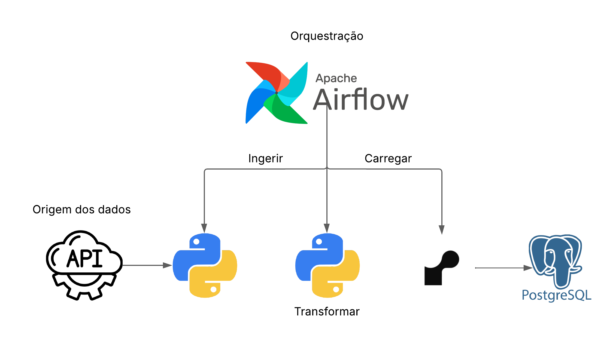

# Projeto AirFlow

Um pipeline de dados (ETL) que extrai dados de uma API e os carrega em um banco de dados, orquestrado com o Apache Airflow.

<p align="center">
  
</p>

## Índice

* [Sobre](#-sobre)
* [Tecnologias Utilizadas](#-tecnologias-utilizadas)
* [Instalação](#-instalação)


## Sobre

Este projeto foi desenvolvido com o objetivo de aplicar e consolidar conhecimentos em Apache Airflow, focando na construção de um pipeline de ETL (Extração, Transformação e Carga) completo e automatizado.

O pipeline orquestrado pelo Airflow é responsável por:

Extrair (Extract): Coletar dados da cotação atual do Bitcoin (BTC) a cada 5 minutos, consumindo a API pública V2 da .

Transformar (Transform): Estruturar os dados recebidos. A lógica de transformação, contida no diretório include/, adiciona colunas de metadados, como um id único e uma data_criacao (timestamp) no momento da inserção.

Carregar (Load): Inserir os dados tratados em um banco de dados PostgreSQL hospedado na plataforma , permitindo a criação de um histórico de cotações para futuras análises.

## Tecnologias Utilizadas

Liste as principais ferramentas, frameworks e linguagens que você usou.
* Linguagem (Python)
* Ferramentas (Astro e Airflow)
* Banco de Dados (PostgreSQL)
* Outros (Docker)

## Instalação

Forneça um guia passo a passo sobre como um outro desenvolvedor pode configurar o ambiente e instalar o seu projeto.

```bash
# 1. Clone o repositório
git clone [https://github.com/jeandata/exercicios-airflow.git]

# 2. Acesse a pasta do projeto
cd seu-projeto

# 3. Instale as dependências (exemplo com pip para Python)
pip install -r requirements.txt

Instale o aiflow. Eu aconselho utilizar o asto-cli, pois é uma das maneiras mais rápidas de instalar o aiflow.

Crie um .env com a localização para o banco de dados:
URLPOSTGRES = postgresql://enderecodobanco.db